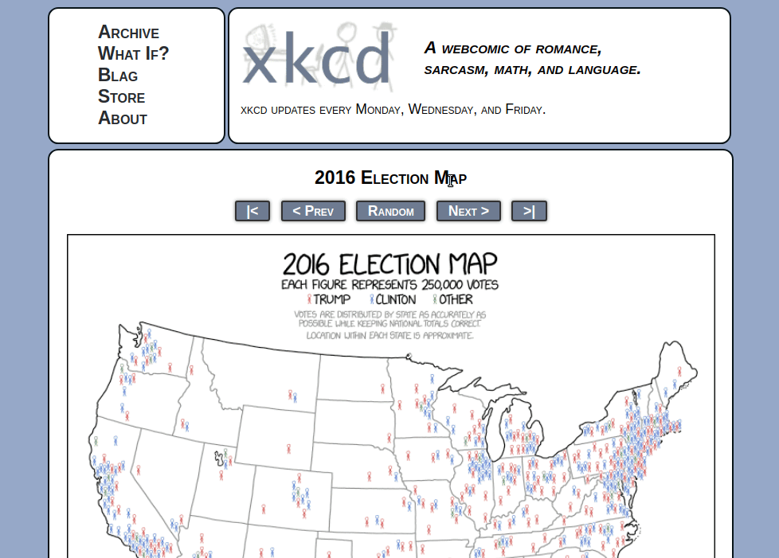

<div class="tldr">
  Scraping is a form of extracting HTML from a website programmatically. In Ruby all you need to scrape a site is Nokogiri (to parse HTML) and Open-URI (to make HTTP requests).
</div>

[Web scraping](https://en.wikipedia.org/wiki/Web_scraping) is a form of data extraction from web pages. It is usually used as a last resort if a site doesn't provide an API or some other form of structured data.

## Things to Consider
Scraping and be used for fun or simply to practice your coding skills, I should note though that there are websites out there that don't want you to scrape and try to prevent you from doing so. You should always make sure that it's ok for you to scrape a site if you're embarking upon a large project.

<!--more-->

You can scrape websites in many different languages, we're going to look at a way to do it in Ruby. To scrape a website in Ruby all you need is the right gem. For instance, you might build a [CLI](https://en.wikipedia.org/wiki/Command-line_interface) application that retrieves a list of new movies playing in your theatre nearby. It can be a little complicated at first but once you get the hang of it it’s quite easy, especially if you’re already familiar with HTML and CSS.

## What You Need to Get Started

Open-URI, Nokogiri and Ruby of course. Open-URI is a Ruby module that allows you to make HTTP requests (it requires no installation as it comes shipped with ruby) and Nokogiri is a gem that helps you parse that retrieved HTML and collect data from it. Make sure you have [Ruby](https://www.ruby-lang.org/en/documentation/installation/) and [Nokogiri](http://www.nokogiri.org/tutorials/installing_nokogiri.html) installed(check with `ruby -v` `and nokogiri -v`), create a new ruby file and require Nokogiri and Open-URI.

<div class="code-menu">Ruby</div>
```ruby
# scraper.rb
require 'open-uri';
require 'nokogiri';
```

## Let the Scraping Begin
Pick a site you want to scrape, save your target website’s HTML into a variable and convert it into a NodeSet (nested nodes) with Nokogiri (save the NodeSet into another variable).
<div class="code-menu">Ruby</div>
```ruby
# scraper.rb
require 'open-uri';
require 'nokogiri';

html = open("https://xkcd.com/")
doc = Nokogiri::HTML(html)

# or combine them into one with:
# doc = Nokogiri::HTML(open("https://xkcd.com/"))
```

If we were to throw this into our [irb console](http://ruby-doc.org/stdlib-2.0.0/libdoc/irb/rdoc/IRB.html) and `puts` out our doc variable we would get something like this (an HTML document):

<div class="code-menu">Bash</div>
```bash
<!DOCTYPE html>
<html>
<head>
<link rel="stylesheet" type="text/css" href="/s/b0dcca.css" title="Default">
<title>xkcd: 2016 Election Map</title>
<meta http-equiv="X-UA-Compatible" content="IE=edge">
<link rel="shortcut icon" href="/s/919f27.ico" type="image/x-icon">
<link rel="icon" href="/s/919f27.ico" type="image/x-icon">
<link rel="alternate" type="application/atom+xml" title="Atom 1.0" href="/atom.xml">
<link rel="alternate" type="application/rss+xml" title="RSS 2.0" href="/rss.xml">
<script type="text/javascript" src="/s/b66ed7.js" async></script>
<script type="text/javascript" src="/s/1b9456.js" async></script>

</head>
<body>
<div id="topContainer">
<div id="topLeft">
<ul>
<li><a href="/archive">Archive</a></li>
<li><a href="http://what-if.xkcd.com">What If?</a></li>
...
```

We don't have to deal with this though because Nokogiri will help us parse it. To get only the element that we want, go to your target website, inspect the element you want to pull data from, and use the desired CSS selector to select the element with Nokogiri.



Adding this selector to your ruby file will give us the node with the id of "ctitle": `<div id="ctitle">Color Models</div>`. In order to get only the text of that element we add a `.text` selector. This will output only the text of that node.

<div class="code-menu">Ruby</div>
```ruby
doc.css("div#ctitle").text
# "Color Models"
```

## Full Code
The full code nicely organized.
<div class="code-menu">Ruby</div>
```ruby
# scraper.rb

# Require libraries/modules
require 'nokogiri'
require 'open-uri'

# Create your scraper class
class Scraper

  # Get the HTML from your desired website
  def get_page
    doc = Nokogiri::HTML(open("https://xkcd.com/"))
  end
  
	# Define where your sought after element is and 'puts' it out
  def print_first_title
    first_title = self.get_page.css("div#ctitle").first.text
    puts first_title
  end

end

# Call your method
Scraper.new.print_first_title
```

## Further Reading
* [I Don't Need No Stinking API: Web Scraping For Fun and Profit](https://blog.hartleybrody.com/web-scraping/)
* [Parsing HTML with Nokogiri](http://ruby.bastardsbook.com/chapters/html-parsing/)