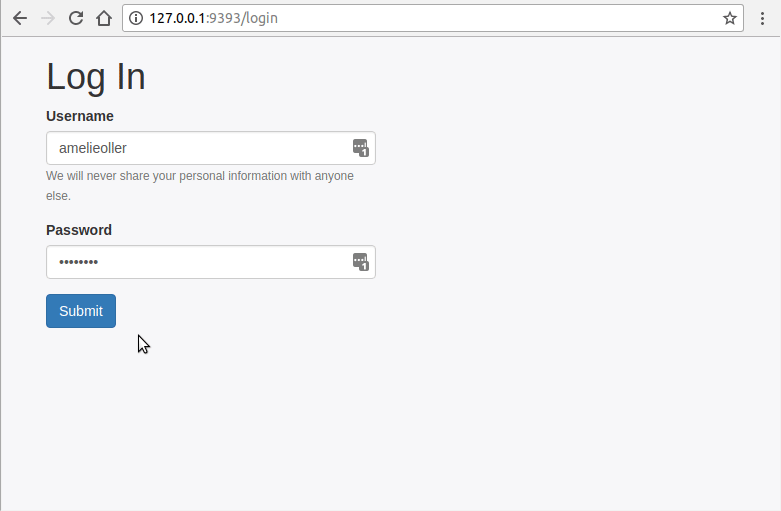
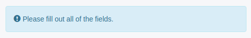

When following the recommended MVC pattern and CRUD actions building a well-structured Sinatra app is a breeze. Read more to learn how to build an outline for just about any Sinatra CRUD app.

Developing a Sinatra app with Ruby can be challenging, especially because there are many conventions and rules you have to follow to create a well-structured app. That part isn't really bad news though, in fact, it makes your job easier because you don't have to make those decisions that are already made for you (because we all know how hard it is to make decisions).

<!--more-->

To skip around, the sections of this article are: [The Example (Favorite Places)](#the-example-favorite-places) &#124; [MVC (Model-View-Controller)](#mvc-model-view-controller) &#124; [File/Folder Structure](#filefolder-structure) &#124; [CRUD](#crud) &#124; [Tools](#tools) &#124; [Stumbling Blocks](#stumbling-blocks) &#124; [Further Reading](#further-reading).

## The Example (Favorite Places)
The app I build, called [Favorite Places](https://github.com/amelieoller/favorite-places) is a simple [CRUD](#crud) application that lets you sign up/sign in and create your very own favorite places (name, city, country). You can create, read, update and delete your own places and view entries by other people.

I will be explaining roughly how I set up my app, the tools I used, and the concepts around it. If you want to try out the app:
1. Clone the repo [Favorite Places](https://github.com/amelieoller/favorite-places)
2. `cd` into the folder
3. Run `bundle install` (to install all the gems) and `rake db:migrate` (to set up the database)
3. Run `shotgun` (to create a server) and open the provided link in your browser

## MVC (Model-View-Controller)

It would be possible to create such an application all in one file, with hundreds, maybe thousands of lines of code in it - but that would get problematic quickly. You should separate your application so that writing, reading and debugging becomes easier and a lot more pleasant - not just for you but possible contributors as well.

One popular [*separation of concerns*](https://stackoverflow.com/a/98765) structure is Model-View-Controller or MVC:

- Models: Models are the "brains” of your application, this is the place to manipulate your data.
- Views: Views provide the user interface of your application, everything the user can see and interact with is stored in your views.
- Controllers: Controllers are the layer between the views and the models, they connect the two and make them talk to each other.

Read more about the Model-View-Controller Structure: [Understanding Model-View-Controller](https://blog.codinghorror.com/understanding-model-view-controller/).

There are certain naming conventions for an MVC folder structure that you should follow:

| Component | Pluralization | Location    | File             | Constant    |
| ------------- | ----------------- | --------------- | -------------------- | --------------- |
| *Tables*         | plural            | Database        | songs                |                 |
| *Models*         | singular          | app/models      | song.rb              | Song            |
| *Controllers*    | plural            | app/controllers | songs_controller.rb  | SongsController |
| *Views*         | plural            | app/views/songs | index.erb, show.erb… |                 |

The naming conventions will make more sense after looking at the File/Folder Structure.

## File/Folder Structure

When you are staring with a blank file, it’s always nice to have some kind of template to lean on, so you don’t lose your mind completely. The folder structure I am outlining here is pretty standard and not necessarily specific to the application I built; therefore, it can be used for many different Sinatra projects.

### The `app` Directory
This directory holds the main part of our application, it neatly contains our models, views, and controllers.

### The `models` Directory
This folder contains our models, each model file represents a component of your application - in this case User, Place, and Country. The application controller is what ties the other controllers together and is generally required for an application such as this one. It contains a `configure` block which tells the controller where to find the views and the public directory and usually `helpers`, which is where global helper methods go.

### The `views` Directory
This directory holds different views, which the end user is going to see. The views are again grouped into folders for each component. `index` and `layout` (provides a layout for all your erb files) in the main directory are not specific to any component.

The views files are in the [`erb` file format](http://www.stuartellis.name/articles/erb/) (embedded Ruby) which allows you to write plane old html interspersed with Ruby elements.

### The `config` Directory
This contains your `environment.rb` file, connecting all of the files in our application to the appropriate gems and each other.

### The `db` Directory
This directory holds your database and database migrations. To create a new migration simply run `rake db:create_migration NAME=create_users` with the name to match your migration - and rake will create a migration for you with the appropriate time stamp.

### The `public` Directory
This holds the assets for your front end such as CSS stylesheets, JavaScript files, and image files.

### The `spec` Directory
If you were to run test for your application, this is where they would be stored.

### The `config.ru` File
You need a `config.ru` when building Rack based applications. It loads your application environment, code, libraries, and specifies which controllers to load. 

### The `Gemfile`
This holds a list of all the gems that are required for the application. Running `bundle install` in your command line will install all the listed gems and dependencies. To create a new `Gemfile` simply type `bundle init` in your terminal (make sure your’re in the root of your project).

### The `Rakefile` 
In the `Rakefile` you can specify your own rake tasks. To see all of the rake tasks that are available to you simply run `rake -T`. Learn more about creating Rake tasks: [Using Rake to Automate Tasks](http://www.stuartellis.name/articles/rake/).

### Other Files
You may want to add a `README.md` to your directory to help other programmers understand your application, figure out how to use it and learn how they may contribute. The `LICENSE.md` file contains your license. 

## CRUD
CRUD is an acronym for Create, Read, Update, and Delete, these are the four basic functions of [persistent storage](https://en.wikipedia.org/wiki/Persistence_(computer_science)).

**Create** allows a user to create or add new entries; this adds a new record to the database (executing an INSERT statement). In your controller this is the action that renders the */places/new* form view which when submitted creates a new instance of your model.

**Read** is to read, retrieve or view existing entries; it fetches specific records from the database and displays them on the page. It shows your user either a specific instance of a class (*/places/:id*) or all of them (*/places* or */users/:username*).

**Update** allows for updating or editing existing entries which modifies a record in your database (it performs an UPDATE statement). For this to work you need a controller action that renders an update form view for a specific entry (*/places/:id/edit*) and another that receives the information of the posted form.

**Delete** permits a user to delete or remove an existing entry; it deletes a record (a specific row) in your database. Destroying as opposed to the other actions is generally only available through a delete button (in our case on */users/:username*), rather than a url.

## Tools
### Sinatra
Sinatra is a Domain Specific Language for writing web applications. It is dependent on Rack (which creates the interface behind Sinatra) and is an alternative to other frameworks such as Ruby on Rails but much more light-weight. In a nutshell, Sinatra provides us with pre-written methods that we can use to turn, for example, our CLI application into a web application.

### ORM/ActiveRecord
Databases can get pretty big and complicated, that’s why we need help talking to them. Building our own methods to talk to our database is tedious and not necessary anymore - This is where ORM comes in.

ORM or Object Relational Mapping is the part that sits between your database and your application. The convention is to map (or equate) ruby **classes** with database **tables** and the **instances** of those classes with the **rows** of the table. ActiveRecord is a Ruby library that does exactly that - it connects classes to relational SQL Databases.

So essentially ActiveRecord is an ORM that helps you deal with databases or as [rubyonrails.org](http://guides.rubyonrails.org/active_record_basics.html) explains it: “ActiveRecord is the M in MVC - the model - which is the layer of the system responsible for representing business data and logic.”

### Git/Github
If you do decide to make your project public, I recommend using version control so other people can understand the changes you’ve made and you always have a way of going back to previous code. Even if you don’t want anyone to see your code, it’s a great option for understanding your code after weeks, months or even years.

## Stumbling Blocks
One specific topic that held me back when I was first creating this app were session messages; more specifically how to delete a certain session message after a page refresh.
The problem I had was that upon refreshing a page and after a session message had already been loaded, this message would load again and again with each refresh.

This is because our message, after a first render, is stored in our session cookie and will stay there until the session is terminated.
The solution ended up being a lot easier that I thought. Instead of using `@message = session[:message]` you simply write `@message = session.delete(:message)`. This will delete the session message with every page refresh.

## Further Reading
* Check out *transient state* at the bottom of this [Sessions in Sinatra](http://webapps-for-beginners.rubymonstas.org/sessions/sinatra_sessions.html) article