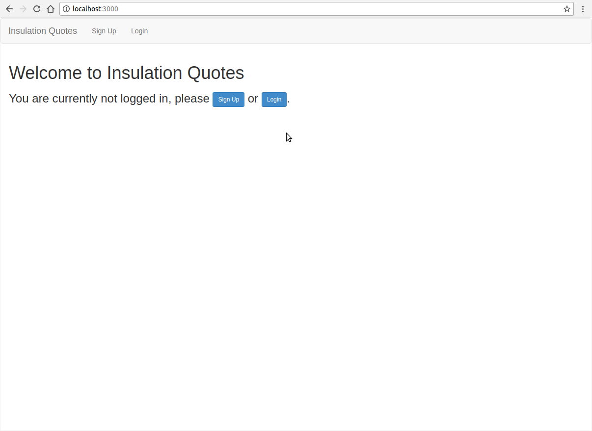

My first Ruby on Rails project turned out to be more challenging but also more fun than I expected. The app is meant for insulation professionals to create quotes more easily.

You can create a new quote with multiple applications (e.g. insulation in the wall/ceiling/floor) and add accessories to the quote. The quote will automatically calculate the type of insulation you should use for a specific application and sort it by which one is the most cost effective.

<!--more-->

## Some things I learned building this app:
* **Separation of concerns** is important! Keep your code where it belongs; it makes writing and debugging your code easier, not just for you but for other people interested in your project (MVC for the win).
* **Clean up your views** (again, separation of concerns). Putting repetitive code into partials and helper methods will make your life so much easier; it makes your code much more readable and reduce the time you spend writing similar components.
* **Make something work, then refactor** ([Red-Green-Refactor](http://blog.cleancoder.com/uncle-bob/2014/12/17/TheCyclesOfTDD.html)). My main point being... refactor! It is important to make your code work like it should, it helps starting from the bottom and moving your way up but it is also important to take that “messy” code and clean it up. - Refactoring can actually be kind of fun!
* **Create seed data**. It helps to create a seed file so you can see what your data is doing and you can imagine what the app will look like with some real world data.

But most of all: Have fun with it! Especially if you’re doing a project you’re passionate about it’ll all come a lot easier to you.

If you're interested, check out the [GitHub repo](https://github.com/amelieoller/insulation-quotes).