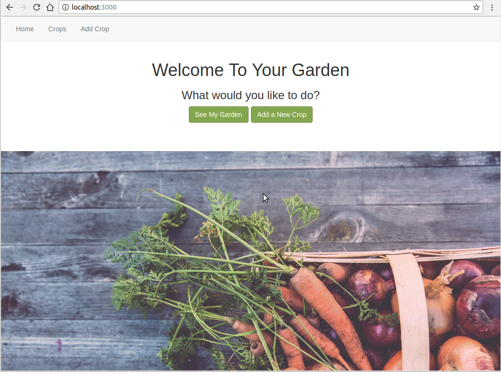

Building a React & Redux app was a lot more challenging than I had expected. Before using React, I had been mostly working in Ruby (on Rails) and a little in JavaScript. Creating a simple CRUD app is what Rails is all about and the framework makes it so easy; I figured this wouldn't be much of a challenge in React either...

<!--more-->

## The Good

Reading about how much people seemed to liked React, I got excited to build an app that was faster, more efficient, and in line with what’s “cool” right now. I have to admit; writing your HTML (JSX) right in your JavaScript is nice (despite the fact that it feels a little messy).

Components, in my opinion, are one of the coolest things about React; being able to create components, reuse, combine or nest them is amazing. When it comes to state, Redux is a great addition to React - essentially it stores an app wide state like a database that you can access, modify or do whatever you want with.

## The Bad

What did bother me at first was that there seemed to be not enough structure/best practices about where to put your files and code. With Rails you have a lot of decisions made for you as to where your files and respectively your code goes, which makes it easy to focus on writing the code itself. 

The biggest hurdle for me was trying to create the edit component of my app. Coming from Rails, it seemed like the easiest thing in the world, and I didn’t think much of it. Once I got to it, however, It didn’t quite work out like I was hoping. 

I didn’t see a good reason to store the changes (handleOnChange) someone made to an item in the redux store, so I decided to do what I thought recommended and save those changes in a React state in that component. Once the form is submitted it is persisted to the Redux store. Simple, right?

But that brought one problem that I didn’t anticipate - two render cycles. Trying to get the state for one item from the Redux store through mapStateToProps resulted in disappointment. On the first render the state was empty and it couldn’t find the item requested. I didn’t think about the props that still had to come in but with componentWillReceiveProps() this problem could be solved - setting the React state when the props come in. I am sure there are better solutions to this problem but I wanted to figure it out my own way - that way I would remember. It was a fun challenge, but next time I think I’m just gonna go with using something like [Redux Form](https://redux-form.com/7.2.0/) - which seems to solve a lot of form problems.

## “The Ugly”

Despite all that and the fact that some of my code might still not quite be in the right place and needs refactoring, the app turned out more or less like planned. It is called Vegetable Garden and in a way it’s just a simple CRUD application for you to create your own garden. You can create your own crops and request more information about a crop from an external api ([OpenFarm](https://openfarm.cc/)).

You can find the [Rails API](https://github.com/amelieoller/vegetable-garden-api) and the [React Client](https://github.com/amelieoller/vegetable-garden-client) on GitHub.

