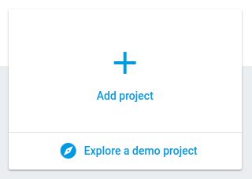
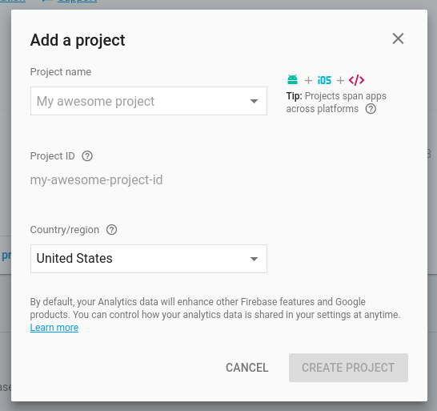
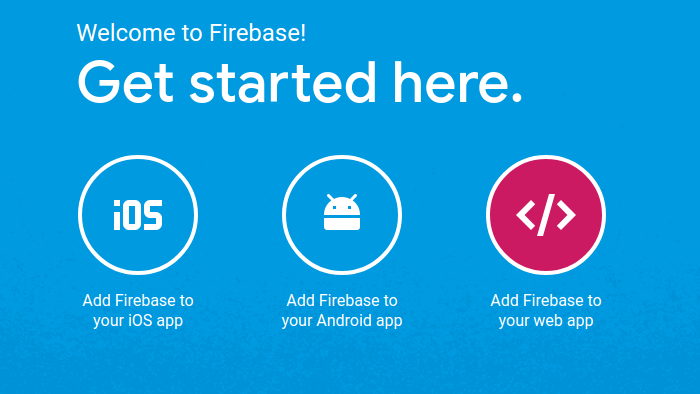
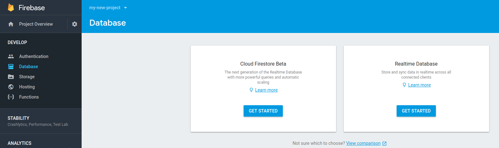

Adding persistent storage to your new React project can be a pain: enter [Firebase](https://firebase.google.com/). Firebase is a Google platform that allows you to develop apps faster. It provides many different built-in services such as authentication, analytics, hosting and, since that's what this article about, a realtime database.

In order to get a database set up with a React app you need to do a few things. First things first - add firebase to your `package.json` with `yarn add firebase` or `npm install --save firebase`.

<!--more-->

## Set Up a New Firebase Project
Create a [new firebase account](https://firebase.google.com/) if you don't have one yet and add a new project:



After creating your project click on the "Add Firebase to your web app" button in the middle of the page and copy the code snippet that pops up.

That code snippet needs to be added to your project; create a new file `firebase.js` in the `src` directory of your project and paste in the code (make sure to remove all the script tags since we're pasting it into a .js file).

## Import Firebase Into Your App
Next add `import * as firebase from 'firebase'` to the top of that file and `export const database = firebase.database().ref('/notes')` to the bottom of the file (the ref `notes` essentially creates a new table for you in firebase). You should, of course, customize this name to fit the data you're sending from your project.

Go back to your firebase console in your browser, click on database on the left and then `get started` under `Realtime Database`. Select the `start in test mode` option (if you haven't set up authentication yet - this can and should be changed later) and click enable.


## Creating Your Component
Now to the fun part... creating your component. It may look something like this:

```js
import React, { Component } from 'react';
import { database } from '../../firebase';
import _ from 'lodash';

class App extends Component {
	constructor(props) {
		super(props);
		this.state = {
			title: '',
			body: '',
			notes: {}
		};

		// bind
		this.handleChange = this.handleChange.bind(this);
		this.handleSubmit = this.handleSubmit.bind(this);
		this.renderNotes = this.renderNotes.bind(this);
	}

	// This is where we fetch our notes from the database
	componentDidMount() {
		database.on('value', snapshot => {
			this.setState({
				notes: snapshot.val()
			});
		});
	}

	// Handling the input field changes while we type and setting the state appropriately
	handleChange(e) {
		this.setState({
			[e.target.name]: e.target.value
		});
	}

	// Handling form submit to create a new note from the state and push it to our firebase database
	handleSubmit(e) {
		e.preventDefault();
		const note = {
			title: this.state.title,
			body: this.state.body
		};
		database.push(note);
		this.setState({
			title: '',
			body: ''
		});
	}

	// Mapping over our fetched notes (that are in ) and rendering them
	renderNotes() {
		return _.map(this.state.notes, (note, key) => {
			return (
				<div>
					<h3>{note.title}</h3>
					<p>{note.body}</p>
				</div>
			);
		});
	}

	render() {
		return (
			<div>
				<h2>Create a New Note:</h2>
				<form onSubmit={this.handleSubmit}>
					<input
						type="text"
						name="title"
						value={this.state.title}
						onChange={this.handleChange}
					/>
					<textarea
						type="text"
						name="body"
						value={this.state.body}
						onChange={this.handleChange}
					/>
					<input type="submit" />
				</form>
				{this.renderNotes()}
			</div>
		);
	}
}

export default App;

```

It would make sense to separate this component out into different components, for instance, a noteForm component and a noteCard component. It would also be very easy to add Redux to this - more on that maybe in another post. For more information on setting up the firebase database with your React Project, check out [this documentation](https://firebase.google.com/docs/database/web/start).
